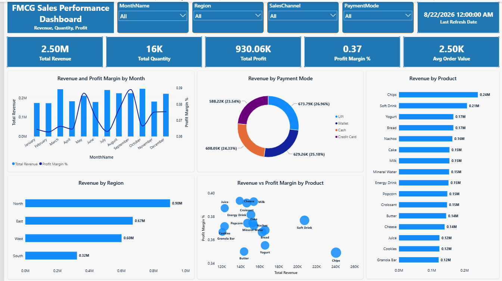

# FMCG Sales Dashboard – Power BI



## Project Overview

This project presents an interactive FMCG sales dashboard developed in Microsoft Power BI. The dashboard provides a clear overview of sales performance and allows users to analyse revenue, profit, quantity, profit margin and average order value across products, regions, channels, payment methods and months.

## Business Objectives

The dashboard was developed to answer the following business questions:

* How much revenue and profit did the business generate?
* Which products generate the highest revenue?
* Which regions and sales channels perform best?
* Which payment methods are most frequently associated with revenue?
* How does sales performance change from month to month?
* Which products provide high revenue and strong profit margins?
* Which products sell large quantities but generate lower margins?

## Key Performance Indicators

The dashboard contains the following KPI cards:

* Total Revenue
* Total Quantity
* Total Profit
* Profit Margin %
* Average Order Value
* Latest Sales Date

## Dashboard Filters

Users can filter the complete dashboard by:

* Month
* Region
* Sales Channel
* Payment Mode

All KPI cards and charts respond dynamically to these selections.

## Dashboard Visuals

### Monthly Revenue and Profit Margin

A combination chart is used to compare monthly revenue with profit margin percentage.

### Revenue by Payment Mode

This chart compares revenue generated through Cash, Credit Card, UPI and Wallet payments.

### Revenue by Product

This chart identifies the highest- and lowest-revenue products.

### Revenue by Region

This chart compares business performance across North, South, East and West regions.

### Revenue vs Profit Margin by Product

The scatter chart compares product performance using three measures:

* X-axis: Total Revenue
* Y-axis: Profit Margin %
* Bubble size: Total Quantity
* Bubble category: Product Name

Products in the upper-right area generally have both high revenue and high profit margins.

## Data Model

The project uses a star-schema data model containing one fact table and five dimension tables:

* `Sales_Fact`
* `Dim_Date`
* `Dim_Product`
* `Dim_Customer`
* `Dim_Channel`
* `Dim_Payment`

The dimension tables have one-to-many relationships with the central sales fact table.

## Main DAX Measures

```DAX
Total Revenue =
SUM(Sales_Fact[Revenue])
```

```DAX
Total Quantity =
SUM(Sales_Fact[Quantity])
```

```DAX
Total Profit =
SUM(Sales_Fact[Profit])
```

```DAX
Profit Margin % =
DIVIDE(
    [Total Profit],
    [Total Revenue],
    0
)
```

```DAX
Average Order Value =
DIVIDE(
    [Total Revenue],
    [Total Transactions],
    0
)
```

## Key Insights

* Total revenue is approximately 2.50 million.
* Total profit is approximately 930 thousand.
* Overall profit margin is approximately 37.21%.
* Approximately 15,743 units were sold.
* North is the highest-revenue region.
* Online is the strongest sales channel.
* UPI generates the highest revenue among payment methods.
* October is the highest-revenue month.
* Snacks is the highest-revenue product category.

## Tools and Skills Used

* Microsoft Power BI
* Power Query
* DAX
* Data modelling
* Star-schema design
* Data visualisation
* Business intelligence
* Sales analysis

## Files

* `FMCG_Sales_Dashboard_Corrected.pbix` – Power BI dashboard
* `FMCG_Sales_StarSchema.xlsx` – source dataset
* `dashboard-preview.png` – dashboard preview

## Dataset Note

This project uses a synthetic FMCG dataset created for educational and Power BI practice purposes. It does not represent the performance of an actual company.

## Author

Qais Bin Qadeer
Data Scientist | Data Analyst | Statistical Analyst | Power BI | Python | SQL | Excel

